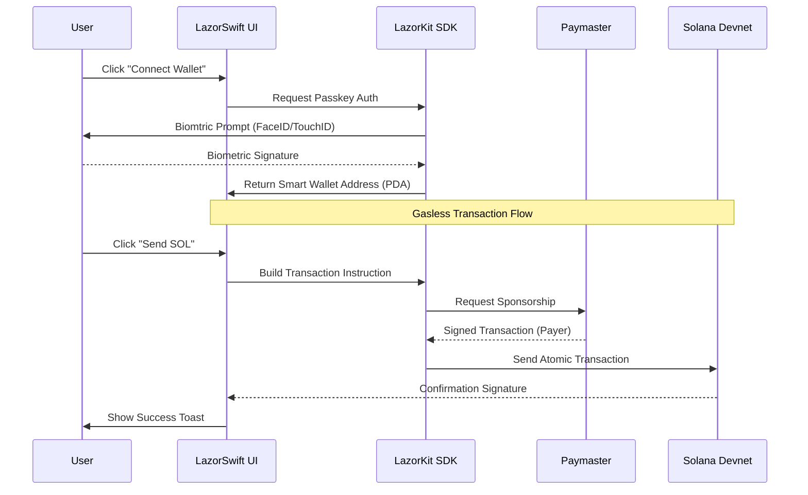

# LazorSwift

[](https://vercel.com/new/clone?repository-url=https%3A%2F%2Fgithub.com%2F0xsupremedev%2Flazor-swift)
[](https://opensource.org/licenses/MIT)
[](https://www.typescriptlang.org/)
[](https://nextjs.org/)
[](https://solana.com/)
[](https://lazorkit.com)

**The fastest way to build Passkey-native Solana apps.**

Built for the **LazorKit Bounty**, LazorSwift demonstrates a premium, high-conversion onboarding flow using biometric authentication and gasless transactions. It abstracts away seed phrases, private keys, and gas fees, delivering a Web2-like experience on Web3 rails.

---

## Key Features

### Zero-Friction Auth
- **Hardware-Bound Passkeys**: Securely login with FaceID, TouchID, or Windows Hello.
- **Non-Custodial**: Keys never leave the user's Secure Enclave.
- **No Seed Phrases**: Eliminates the comprehensive risk of phishing and loss.

### Gasless & Atomic
- **Sponsored Transactions**: integrated Paymaster automatically sponsors SOL fees.
- **Batch Transfers**: Send to multiple recipients in a single, atomic transaction.
- **USDC Support**: Native support for SPL tokens and "Pay with Token" flows.

### Developer Ready
- **Embeddable Widget**: A "Pay with Lazor" component ready for any React app.
- **Real-time QR**: Dynamic QR code generation for instant wallet sharing.
- **Unified Config**: Centralized environment management for easy switching between Devnet/Mainnet.

---

## Architecture

LazorSwift leverages **Account Abstraction** to decouple the signer (Passkey) from the account (Smart Wallet).



---

## Tech Stack

- **Framework**: [Next.js 15](https://nextjs.org/) (App Router, Turbopack)
- **Styling**: [Tailwind CSS 4](https://tailwindcss.com/) + [Radix UI](https://www.radix-ui.com/)
- **Icons**: [Lucide React](https://lucide.dev/)
- **Blockchain**: Solana (Devnet)
- **SDK**: [@lazorkit/wallet](https://docs.lazorkit.com/)
- **Notification**: [Sonner](https://sonner.emilkowal.ski/)

---

## Quick Start

### 1. Clone & Install

```bash
git clone https://github.com/0xsupremedev/lazor-swift.git
cd lazor-swift
npm install
```

### 2. Install LazorKit SDK (for your own project)

```bash
npm install @lazorkit/wallet @solana/web3.js
```

### 3. Environment Setup

Create a `.env.local` file (optional, defaults work for Devnet):

```env
# Solana RPC URL (defaults to Devnet)
NEXT_PUBLIC_RPC_URL=https://api.devnet.solana.com

# LazorKit Portal (for passkey authentication)
NEXT_PUBLIC_LAZOR_PORTAL_URL=https://portal.lazor.sh
```

### 4. Run Dev Server

```bash
npm run dev
```

Open [http://localhost:3000](http://localhost:3000) in your browser.

### 5. Try the Demo

- Connect your wallet using a local Passkey (FaceID/TouchID/Windows Hello)
- Use the **Session Info** card to grab some Devnet SOL from the airdrop
- Try the **Batch Transfer** to send to multiple addresses at once
- Scan the **QR Code** to receive funds from mobile wallets

---

## Tutorials

Step-by-step guides for integrating LazorKit:

| Tutorial | Description |
|----------|-------------|
| [Passkey Login](./docs/TUTORIAL_PASSKEY_LOGIN.md) | How to add passkey-based wallet authentication |
| [Gasless Transactions](./docs/TUTORIAL_GASLESS_TX.md) | How to send SOL/tokens without gas fees |

---

## Components

| Component | Description |
|-----------|-------------|
| `<ConnectWallet />` | Handles Passkey registration and login state. |
| `<SessionInfo />` | Dashboard showing SOL/USDC balances and Airdrop button. |
| `<BatchTransfer />` | Form for executing multi-recipient atomic transactions. |
| `<RequestPayment />` | Generates a live QR code for the user's Smart Account. |
| `<PaymentWidget />` | Embeddable checkout card with clipboard utilities. |
| `<ActivityFeed />` | Live stream of recent Smart Account transactions. |

---

## License

MIT © [0xsupremedev](https://github.com/0xsupremedev)
